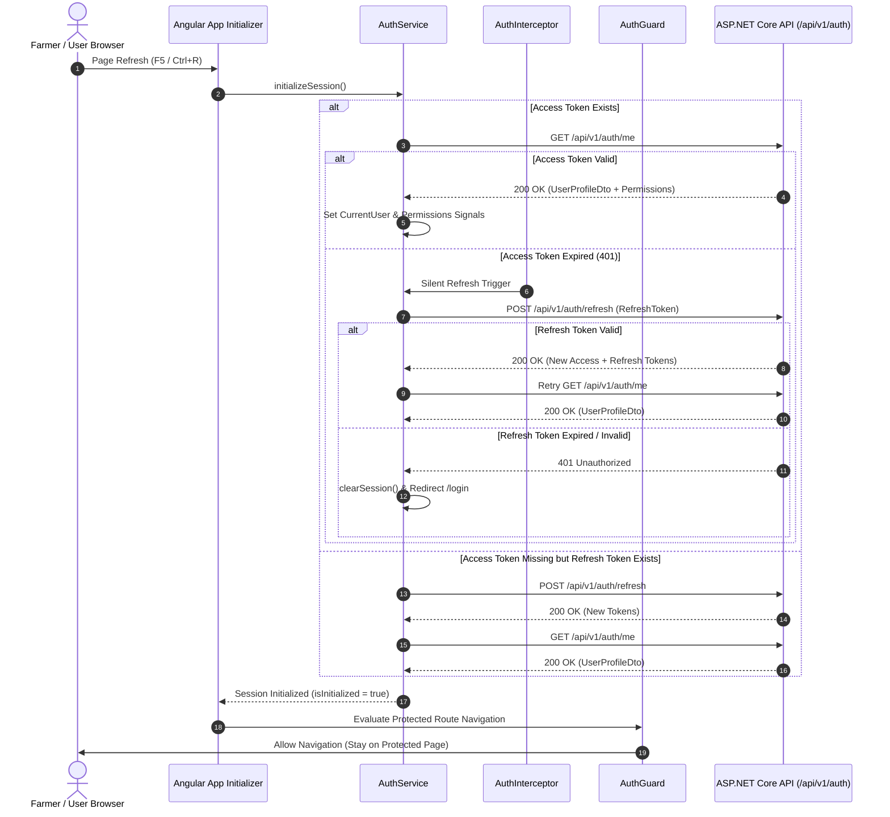

# Authentication Session Persistence & Auto-Login Implementation Plan

**Project:** Farm360 AI  
**Role:** Principal ASP.NET Core Identity Architect & Senior Angular Authentication Expert  
**Governing Documents:** `/docs/*`, `PROJECT_CONSTITUTION.md`, `SOFTWARE_ARCHITECTURE.md`, `DEVELOPMENT_STATUS.md`

---

## 1. Root Cause Analysis

### Identified Failure Points
1. **Asynchronous Navigation Race Condition during Angular Bootstrap**:
   - `AuthService` initiated `loadUser()` in its constructor via an unawaited HTTP GET call to `/api/v1/auth/me`.
   - On browser refresh (F5 / Ctrl+R), Angular evaluated `authGuard` synchronously before `loadUser()` completed.
   - If the access token was missing or expired, `authGuard` immediately redirected to `/login`, wiping session state.
2. **Missing App Initializer (`provideAppInitializer`)**:
   - The application lacked an initialization hook to block initial router navigation until token validation or silent token refresh completed.
3. **Naïve HTTP 401 Interceptor Handling**:
   - In `auth.interceptor.ts`, receiving any `401 Unauthorized` response immediately triggered `authService.logout()`, clearing `localStorage` and forcing a redirect to `/login`.
   - The interceptor did not attempt a silent token refresh via `authService.refresh()` using the stored `refreshToken`.
4. **Missing Permission Restoration in `GET /api/v1/auth/me`**:
   - `UserProfileDto` returned `Id`, `TenantId`, `Role`, `Tier`, `IsSystemUser`, but omitted the user's permission list (`Permissions`), preventing permission state restoration on reload.

---

## 2. Authentication Lifecycle Diagram

---

## User Review Required

> [!IMPORTANT]
> **Enterprise Silent Refresh Implementation:**
> The `authInterceptor` will be upgraded with request queuing. When an expired access token produces a `401 Unauthorized` error on a protected request, the interceptor will pause outgoing requests, trigger a single POST to `/api/v1/auth/refresh`, update `localStorage` tokens, and retry all queued requests seamlessly.

> [!NOTE]
> **Session Restoration UX:**
> `AppComponent` will render a dark enterprise loading splash screen ("Restoring Session...") while `isInitialized` is `false` during browser boot, preventing any visual flash of the Login component or unauthenticated layout.

---

## Proposed Changes

### Component 1: Backend Profile & Permission Restoration (`Farm360.Application`)

#### [MODIFY] [GetCurrentUserQuery.cs](file:///d:/Personel/Farm%20Management%20System/src/Farm360.Application/Auth/Queries/GetCurrentUserQuery.cs)
- Update `UserProfileDto` record to include `IReadOnlyList<string> Permissions`.
- Inject `IPermissionService` into `GetCurrentUserQueryHandler` and populate `Permissions` array via `permissionService.GetPermissionsAsync(userId, tenantId)`.

---

### Component 2: Frontend Authentication Service (`Farm360.Web`)

#### [MODIFY] [auth.service.ts](file:///d:/Personel/Farm%20Management%20System/src/Farm360.Web/src/app/core/services/auth.service.ts)
- Add `isInitialized = signal<boolean>(false)` signal and `isInitialized$` observable.
- Implement `initializeSession(): Promise<boolean>` method:
  - If access token exists, fetch `/api/v1/auth/me`. If valid, populate user signal and return `true`.
  - If access token fails with 401 or is missing, attempt `refresh()`. If refresh succeeds, fetch `/api/v1/auth/me` and return `true`.
  - If both fail or no tokens exist, clear session and return `false`.
- Ensure `initializeSession()` sets `isInitialized = true` upon completion.

---

### Component 3: HTTP Interceptor with Silent Refresh & Queuing (`Farm360.Web`)

#### [MODIFY] [auth.interceptor.ts](file:///d:/Personel/Farm%20Management%20System/src/Farm360.Web/src/app/core/interceptors/auth.interceptor.ts)
- Implement request queuing using `BehaviorSubject<string | null>` for concurrent 401 handling.
- On 401 from protected endpoint (excluding `/login` and `/refresh`):
  - If `isRefreshing` is false, trigger `authService.refresh()`, store new tokens, emit token via subject, and retry original request.
  - If `isRefreshing` is true, queue request and retry once new token is emitted.
  - If refresh fails, clear session and navigate to `/login`.

---

### Component 4: Router Guard & App Initialization (`Farm360.Web`)

#### [MODIFY] [auth.guard.ts](file:///d:/Personel/Farm%20Management%20System/src/Farm360.Web/src/app/core/guards/auth.guard.ts)
- Update `authGuard` to await `authService.isInitialized$` (filtering for `true`) before evaluating `authService.isAuthenticated`.

#### [MODIFY] [app.config.ts](file:///d:/Personel/Farm%20Management%20System/src/Farm360.Web/src/app/app.config.ts)
- Register `provideAppInitializer(() => inject(AuthService).initializeSession())`.

#### [MODIFY] [app.component.ts](file:///d:/Personel/Farm%20Management%20System/src/Farm360.Web/src/app/app.component.ts)
- Add splash loading template while `!authService.isInitialized()`.

---

## Verification Plan

### Automated Tests
Execute backend test suite:
- `dotnet test tests/Farm360.Application.UnitTests`
- `dotnet test tests/Farm360.Domain.UnitTests`
- `dotnet test tests/Farm360.Architecture.Tests`

### Angular Production Build
- Run `npm run build` in `src/Farm360.Web` to verify zero TypeScript/Angular compilation errors.

### Manual Verification Matrix
1. **Login Flow**: Log in as valid user (`01711000001` / `Password123!`), verify session tokens stored in `localStorage`.
2. **Browser Refresh (F5 / Ctrl+R)**: Refresh page while on `/livestock` or `/organizations`. Verify user remains logged in on protected route without redirecting to `/login`.
3. **Expired Access Token Silent Refresh**: Manually invalidate `farm360_access_token` in `localStorage` while keeping `farm360_refresh_token` intact, refresh page. Verify silent refresh occurs via POST `/api/v1/auth/refresh` and page loads cleanly.
4. **Expired Refresh Token**: Invalidate both tokens in `localStorage`, refresh page. Verify clean redirect to `/login`.
