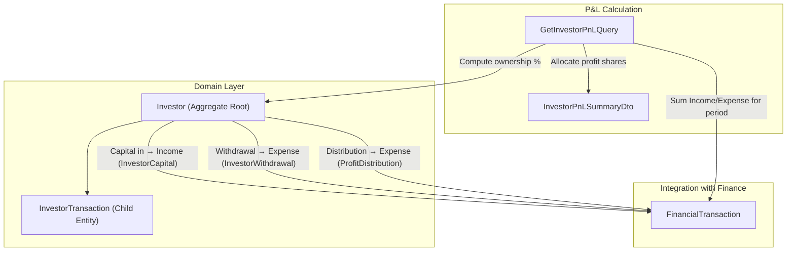

# Investor & Profit-Sharing Module

The farm has multiple investors who contribute varying amounts of capital. Their profit/loss share is proportional to their investment. This plan adds a complete Investor management module that integrates with the existing Finance subsystem.

## User Review Required

> [!IMPORTANT]
> **Profit/Loss Calculation Model** — This plan uses a **percentage-of-capital** model:
> - Each investor's share = `their investment / total pool investment × 100`
> - When the farm generates net profit (Income − Expenses over a period), each investor's share of that profit is proportional to their ownership %.
> - Withdrawals reduce an investor's capital and automatically recalculate all ownership percentages.

> [!WARNING]
> **Scope Decision** — This plan does **NOT** auto-distribute cash to investors. It calculates and displays each investor's P&L share on a dashboard. Actual cash distribution (bank transfer, cheque, etc.) is recorded manually as a "Distribution" transaction. This keeps the system simple and auditable.

## Open Questions

> [!IMPORTANT]
> 1. **Should investors be per-farm or per-tenant?** This plan assumes **per-farm** (each farm can have its own investor pool), consistent with how `LoanRecord` and `FinancialTransaction` are scoped to `FarmId`. Confirm?
> 2. **Do you want a distribution/withdrawal feature now?** The plan includes recording capital withdrawals and profit distributions. If you want to defer distributions to a later phase, let me know.
> 3. **Should the existing "Loans & Investments" page remain separate?** Loans (debt with repayment schedules) are conceptually different from equity investments (profit-sharing). This plan adds a new "Investors" page alongside the existing loans page rather than merging them.

---

## Proposed Changes

### Domain Layer (`Farm360.Domain`)

#### [NEW] [Investor.cs](file:///d:/Personel/Farm%20Management%20System/src/Farm360.Domain/Finance/Investor.cs)
New aggregate root representing an investor in a farm:
```
Properties:
  - FarmId (Guid)
  - Name (string, required)
  - ContactInfo (string?, phone/email)
  - TotalInvestedBdt (decimal) — running total of all capital contributions
  - TotalWithdrawnBdt (decimal) — running total of withdrawals/distributions
  - NetCapitalBdt (computed) = TotalInvestedBdt - TotalWithdrawnBdt
  - JoinDate (DateTime)
  - Notes (string?)
  - IsActive (bool)

Methods:
  - Create() — static factory
  - RecordInvestment(amount) — adds to TotalInvestedBdt
  - RecordWithdrawal(amount) — adds to TotalWithdrawnBdt, validates balance
  - UpdateDetails(name, contactInfo, notes)
  - Deactivate() — sets IsActive = false
```

#### [NEW] [InvestorTransaction.cs](file:///d:/Personel/Farm%20Management%20System/src/Farm360.Domain/Finance/InvestorTransaction.cs)
Child entity tracking each capital movement:
```
Properties:
  - InvestorId (Guid, FK)
  - FarmId (Guid)
  - Type (InvestorTransactionType: Investment | Withdrawal | ProfitDistribution)
  - AmountBdt (decimal)
  - TransactionDate (DateTime)
  - Description (string)
  - Notes (string?)
```

#### [NEW] [InvestorTransactionType.cs](file:///d:/Personel/Farm%20Management%20System/src/Farm360.Domain/Finance/Enums/InvestorTransactionType.cs)
```csharp
public enum InvestorTransactionType
{
    Investment = 1,
    Withdrawal = 2,
    ProfitDistribution = 3
}
```

#### [NEW] [IInvestorRepository.cs](file:///d:/Personel/Farm%20Management%20System/src/Farm360.Domain/Finance/Interfaces/IInvestorRepository.cs)
```csharp
public interface IInvestorRepository
{
    Task<Investor?> GetByIdAsync(Guid id, CancellationToken ct);
    Task<IReadOnlyList<Investor>> GetByFarmIdAsync(Guid farmId, CancellationToken ct);
    void Add(Investor investor);
    void Update(Investor investor);
}
```

---

### Contracts Layer (`Farm360.Contracts`)

#### [NEW] [InvestorDto.cs](file:///d:/Personel/Farm%20Management%20System/src/Farm360.Contracts/Finance/InvestorDto.cs)
```
InvestorDto(Id, FarmId, Name, ContactInfo, TotalInvestedBdt, TotalWithdrawnBdt,
            NetCapitalBdt, OwnershipPercent, JoinDate, Notes, IsActive, CreatedAtUtc)
```

#### [NEW] [InvestorTransactionDto.cs](file:///d:/Personel/Farm%20Management%20System/src/Farm360.Contracts/Finance/InvestorTransactionDto.cs)
```
InvestorTransactionDto(Id, InvestorId, InvestorName, Type, AmountBdt, TransactionDate, Description, Notes)
```

#### [NEW] [InvestorPnLSummaryDto.cs](file:///d:/Personel/Farm%20Management%20System/src/Farm360.Contracts/Finance/InvestorPnLSummaryDto.cs)
P&L breakdown per investor for a given period:
```
InvestorPnLSummaryDto(FarmId, PeriodStart, PeriodEnd, TotalIncomeBdt, TotalExpenseBdt,
                      NetProfitBdt, InvestorShares: List<InvestorShareDto>)

InvestorShareDto(InvestorId, InvestorName, OwnershipPercent, ShareOfProfitBdt,
                 TotalInvestedBdt, TotalWithdrawnBdt, NetCapitalBdt)
```

#### [NEW] Request contracts:
- `CreateInvestorRequest(Name, ContactInfo, InitialInvestmentBdt, JoinDate, Notes)`
- `RecordInvestorTransactionRequest(Type, AmountBdt, TransactionDate, Description, Notes)`

---

### Application Layer (`Farm360.Application`)

#### [NEW] Commands:
| File | Purpose |
|------|---------|
| `CreateInvestorCommand.cs` | Creates investor + records initial investment + creates Income ledger entry (category: `InvestorCapital`) |
| `RecordInvestorTransactionCommand.cs` | Records additional investment / withdrawal / profit distribution. Creates corresponding `FinancialTransaction` in the general ledger automatically |
| `UpdateInvestorCommand.cs` | Updates investor details (name, contact, notes) |
| `DeactivateInvestorCommand.cs` | Soft-deactivates an investor |

#### [NEW] Queries:
| File | Purpose |
|------|---------|
| `GetInvestorsQuery.cs` | Returns all investors for a farm with computed `OwnershipPercent` |
| `GetInvestorPnLQuery.cs` | Computes P&L share per investor for a date range (uses existing `IFinancialTransactionRepository` to sum income/expenses) |
| `GetInvestorTransactionsQuery.cs` | Returns capital transaction history for a specific investor |

#### [MODIFY] [TransactionCategory.cs](file:///d:/Personel/Farm%20Management%20System/src/Farm360.Domain/Finance/Enums/TransactionCategory.cs)
Add new categories:
```diff
 // ── System / Loan Categories ────────────────────────────────────────────
 LoanDisbursement = 80,
-LoanRepayment = 81
+LoanRepayment = 81,
+
+// ── Investor Categories ─────────────────────────────────────────────────
+InvestorCapital = 90,
+InvestorWithdrawal = 91,
+ProfitDistribution = 92
```

---

### Persistence Layer (`Farm360.Persistence`)

#### [NEW] [InvestorConfiguration.cs](file:///d:/Personel/Farm%20Management%20System/src/Farm360.Persistence/Configurations/Finance/InvestorConfiguration.cs)
- Table: `finance.Investors`
- Indexes on `FarmId`, `TenantId`
- Owns collection of `InvestorTransaction` → table `finance.InvestorTransactions`

#### [NEW] [InvestorRepository.cs](file:///d:/Personel/Farm%20Management%20System/src/Farm360.Persistence/Repositories/Finance/InvestorRepository.cs)
Standard repository implementing `IInvestorRepository`.

#### [NEW] EF Migration
- `AddInvestorTables` migration adding `finance.Investors` and `finance.InvestorTransactions` tables.

---

### API Layer (`Farm360.Api`)

#### [MODIFY] [FinanceEndpoints.cs](file:///d:/Personel/Farm%20Management%20System/src/Farm360.Api/Endpoints/Finance/FinanceEndpoints.cs)
Add investor routes under the existing finance group:

| Method | Route | Purpose |
|--------|-------|---------|
| `GET` | `investors` | List all investors for a farm |
| `POST` | `investors` | Create a new investor |
| `PUT` | `investors/{id}` | Update investor details |
| `DELETE` | `investors/{id}` | Deactivate investor |
| `POST` | `investors/{id}/transactions` | Record investment / withdrawal / distribution |
| `GET` | `investors/{id}/transactions` | Get investor's capital transaction history |
| `GET` | `investors/pnl?startDate=&endDate=` | Get P&L breakdown across all investors |

---

### Frontend (`Farm360.Web`)

#### [NEW] Models in [finance.model.ts](file:///d:/Personel/Farm%20Management%20System/src/Farm360.Web/src/app/features/finance/models/finance.model.ts)
```typescript
export interface Investor { ... }
export interface InvestorTransaction { ... }
export interface InvestorPnLSummary { ... }
export interface InvestorShare { ... }
export interface CreateInvestorRequest { ... }
export interface RecordInvestorTransactionRequest { ... }
```

#### [MODIFY] [finance.service.ts](file:///d:/Personel/Farm%20Management%20System/src/Farm360.Web/src/app/features/finance/services/finance.service.ts)
Add service methods:
- `getInvestors(farmId)` → `GET /investors`
- `createInvestor(farmId, request)` → `POST /investors`
- `updateInvestor(farmId, id, request)` → `PUT /investors/{id}`
- `deactivateInvestor(farmId, id)` → `DELETE /investors/{id}`
- `recordInvestorTransaction(farmId, investorId, request)` → `POST /investors/{id}/transactions`
- `getInvestorTransactions(farmId, investorId)` → `GET /investors/{id}/transactions`
- `getInvestorPnL(farmId, startDate, endDate)` → `GET /investors/pnl`

#### [NEW] Investor List Page — `pages/investor-list/investor-list.ts`
Premium UI with:
- Grid of investor cards (glassmorphic) showing: name, total invested, ownership %, net capital
- Gradient icon badges, background watermarks per AGENTS.md
- "Add Investor" button → opens dialog
- Per-card actions: "Record Transaction", "View History"

#### [NEW] Investor Form Dialog — `components/investor-form-dialog/investor-form-dialog.ts`
- Fields: Name, Contact Info, Initial Investment Amount, Join Date, Notes
- Premium dialog design per AGENTS.md rules

#### [NEW] Investor Transaction Dialog — `components/investor-transaction-dialog/investor-transaction-dialog.ts`
- Shows investor context card (name, current capital)
- Transaction type selector: Investment / Withdrawal / Profit Distribution
- Amount, Date, Description, Notes fields

#### [NEW] Investor P&L Dashboard — `pages/investor-pnl/investor-pnl.ts`
- Date range picker (month/quarter/year)
- Summary cards: Total Income, Total Expenses, Net Profit
- Table showing each investor's share: Name | Ownership % | Share of Profit | Capital | Status
- Visual chart (bar or pie) of ownership distribution

#### [MODIFY] [finance.routes.ts](file:///d:/Personel/Farm%20Management%20System/src/Farm360.Web/src/app/features/finance/finance.routes.ts)
Add routes:
```typescript
{ path: 'investors', loadComponent: ... InvestorListComponent },
{ path: 'investors/pnl', loadComponent: ... InvestorPnLComponent },
```

#### [MODIFY] Finance sidebar/navigation
Add "Investors" menu item to the finance navigation section.

---

## Architecture Diagram



## How Profit/Loss Sharing Works

1. **Investor joins** → contributes capital (e.g., ৳500,000). A `FinancialTransaction` of type `Income` / category `InvestorCapital` is auto-created in the ledger.
2. **Farm operates** → income (sales) and expenses (feed, vet, etc.) accumulate naturally through existing modules.
3. **P&L Report** → User selects a date range. System calculates:
   - Total farm income and expenses for the period
   - Net Profit = Income − Expenses
   - Each investor's share = (Investor NetCapital / Total Pool NetCapital) × Net Profit
4. **Distribution** (optional) → User records a profit distribution to an investor. An `Expense` / `ProfitDistribution` transaction is created in the ledger.

---

## Verification Plan

### Automated Tests
```bash
dotnet test --filter "FullyQualifiedName~Investor"
```

### Manual Verification
1. Create 3 investors with different capital amounts → verify ownership % auto-calculates
2. Run farm operations (feeding, health, sales) to generate income/expenses
3. Check P&L report → verify profit shares match ownership ratios
4. Record a withdrawal → verify ownership % recalculates across all investors
5. Record a profit distribution → verify it appears in the General Ledger as an expense
6. Build Angular app: `npx ng build --configuration production`
