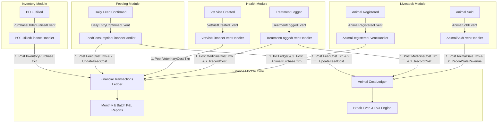

# Enterprise Finance Module Implementation Plan & Architecture Analysis

## Executive Summary & Vision

The Farm360 **Enterprise Finance Module** serves as the central financial ledger and profitability intelligence hub of the platform. It bridges operational actions across **Livestock**, **Health**, **Feeding**, and **Inventory** with automated double-entry cost accounting, real-time unit economics (Cost of Ownership per animal & Break-Even pricing), and executive P&L statements.

In accordance with the **Farm360 AI Product Vision Document (PVD Module 6)**, this plan outlines the architecture, cross-module event pipelines, and UI/UX modernization required to deliver an enterprise-grade financial management system.

---

## 1. Architectural Gap Analysis: Current vs. Enterprise

| Area | Current Implementation | Enterprise Target |
|---|---|---|
| **Livestock Acquisition** | `AnimalRegisteredEventHandler` creates `AnimalCostLedger`. | Create `AnimalCostLedger` **AND** auto-post an Expense transaction (`AnimalPurchase`) to the general ledger when `AcquisitionPriceBdt > 0`. |
| **Livestock Sale** | `AnimalSoldEventHandler` posts `AnimalSale` transaction. | Auto-post `AnimalSale` transaction **AND** update `AnimalCostLedger.RecordSaleRevenue(...)` with the final sale price and calculate realized P&L. |
| **Health Treatments** | `TreatmentLoggedEvent` is fired with `CostBdt`, but not handled by Finance. | Auto-post Expense transaction (`MedicineCost` / `VeterinaryCost`) linked to `AnimalId` **AND** accumulate cost directly into `AnimalCostLedger.TotalVetCostBdt`. |
| **Veterinary Visits** | `VetVisitCreatedEvent` is fired. | Auto-post Expense transaction (`VeterinaryCost`) when visit fees or veterinarian charges are logged. |
| **Feeding & Feed Cost** | Feeding consumption logs are created, but do not synchronize costs to Finance. | On feeding confirmation / reconciliation, calculate feed ingredient cost per kg, post `FeedCost` expense transactions, and update `AnimalCostLedger.TotalFeedCostBdt`. |
| **Inventory Fulfillment** | `PurchaseOrderFulfilledEventHandler` adds `InventoryPurchase` transaction but lacks `IUnitOfWork.SaveChangesAsync()`. | Fix transaction persistence and link purchase orders with vendor and invoice reference numbers. |
| **Ledger Querying** | `GetFinancialTransactionsQuery` returns unpaged, unfiltered list of all records. | Implement `GetPagedFinancialTransactionsQuery` with server-side pagination, date range filtering, type/category filters, search, and summary aggregations (per `pagination_pattern`). |
| **Transaction Lifecycle** | Only Create (Income/Expense/Transaction). | Full CRUD: View Details, Edit/Update Transaction details, Void/Reverse Transaction with audit trail. |
| **Unit Economics & Break-Even** | Simple static formula on a basic page. | Interactive Break-Even & Pricing Calculator with target profit margins (10%, 20%, 30%), feed cost per kg gained, and historical animal transaction audit trail. |
| **Reporting & Multi-Farm** | Basic monthly report and batch report. | Comprehensive Monthly P&L statement, Multi-farm Consolidated P&L matrix, CSV/PDF export capabilities, and batch profitability rankings. |
| **Frontend UI/UX** | Basic placeholder shells and unlinked routes. | Enterprise UI suite with dedicated tabs/sub-navigation, glassmorphic KPI cards, interactive date range filters, RFC 7807 error handling, and signal-driven reactive state. |

---

## 2. Cross-Module Event-Driven Cost Engine

---

## 3. Phased Implementation Plan

### Phase 1: Event Synchronization & Domain Cost Automation
- **Fix PO Fulfillment Persistence**: Inject `IUnitOfWork` into `PurchaseOrderFulfilledEventHandler` and call `SaveChangesAsync`.
- **Livestock Purchase Auto-Posting**: Update `AnimalRegisteredEventHandler` to post an `AnimalPurchase` `FinancialTransaction` when `AcquisitionPriceBdt > 0`.
- **Livestock Sale Cost Ledger Sync**: Update `AnimalSoldEventHandler` to fetch the animal's `AnimalCostLedger` and call `ledger.RecordSaleRevenue(domainEvent.SalePriceBdt)` alongside creating the `FinancialTransaction`.
- **Health Treatment Event Integration**: Create `TreatmentLoggedEventHandler` in `Farm360.Application/Finance/EventHandlers/Integration/`:
  - Posts a `MedicineCost` or `VeterinaryCost` expense transaction linked to `AnimalId`.
  - Accumulates cost in `AnimalCostLedger.RecordCost(TransactionCategory.MedicineCost, costBdt)`.
- **Vet Visit Event Integration**: Create `VetVisitCreatedEventHandler` to post a `VeterinaryCost` expense if consultation fees are specified.
- **Feeding Cost Sync**: Create integration handler for feeding confirmation that calculates daily feeding cost and updates `AnimalCostLedger.UpdateFeedCost(...)` and creates `FeedCost` financial transactions.

### Phase 2: High-Performance General Ledger (CQRS & Pagination)
- **Domain & Persistence**:
  - Add `GetPagedAsync` to `IFinancialTransactionRepository` and `FinancialTransactionRepository`:
    - Filters: `farmId`, `pageNumber`, `pageSize`, `search`, `type`, `category`, `startDate`, `endDate`, `animalId`, `batchId`, `sortBy`, `sortDesc`.
    - Returns `(IReadOnlyList<FinancialTransaction> Items, int TotalCount, decimal TotalIncome, decimal TotalExpense)`.
  - Add `UpdateFinancialTransactionCommand` and `VoidFinancialTransactionCommand` (soft delete / reversal).
- **Application CQRS**:
  - `GetPagedFinancialTransactionsQuery` implementing `IRequest<PagedResult<FinancialTransactionDto>>` with summary metadata.
- **API Endpoints**:
  - `GET /api/farms/{farmId}/finance/transactions` (updated to accept query params: page, pageSize, search, type, category, startDate, endDate).
  - `PUT /api/farms/{farmId}/finance/transactions/{id}` (update details).
  - `DELETE /api/farms/{farmId}/finance/transactions/{id}` (void transaction).
  - `GET /api/farms/{farmId}/finance/transactions/export` (CSV download).

### Phase 3: Financial Analytics & Unit Economics Engines
- **Enhanced Financial Dashboard Query**:
  - Real-time MTD & YTD Revenue, Expense, Net Margin, MOM comparison.
  - 6-Month rolling Cash Flow chart data (Monthly Inflow vs Outflow).
  - Top Expense Categories breakdown.
  - Recent transactions list.
- **Comprehensive Animal Cost Ledger Query**:
  - Returns running cost buckets: Acquisition, Feed, Veterinary, Labor, Overhead, Total Cost.
  - Break-Even sale price per kg (Total Cost / Current Weight).
  - Profit margin targets (+10%, +20%, +30%) showing required sale price per kg and total revenue.
  - Audit trail of all financial transactions tied to this specific animal.
- **Batch P&L & ROI Query**:
  - Batch summary: Number of animals, total purchase cost, total feed consumed cost, total vet costs, total sale revenue realized, gross profit, ROI %, average cost per animal, average break-even sale price.
- **Consolidated Multi-Farm Statement**:
  - Tenant-wide P&L matrix comparing all farms side-by-side with consolidated net profit.

### Phase 4: Modern Enterprise UI Suite (Angular 19 + Signals)
- **Finance Navigation & Hub Layout**:
  - Create a cohesive navigation bar or sub-tab system within `/finance`:
    1. **Dashboard** (`/finance`) - KPI cards, rolling cash flow chart, expense breakdown, quick action shortcuts.
    2. **General Ledger** (`/finance/transactions`) - Filterable date range, type/category pills, search, server-side pagination, export button, action menu (View, Edit, Void).
    3. **Loans & Credit** (`/finance/loans`) - Active loans grid with repayment progress bars, principal/interest metrics, record repayment dialog, add loan dialog.
    4. **Animal Unit Economics** (`/finance/animal-ledger/:animalId` & animal selector) - Visual cost gauge, cost breakdown cards, dynamic break-even calculator, animal transaction history.
    5. **Batch Profitability** (`/finance/reports/batch-pnl/:batchId` & batch selector) - Batch ROI metrics, comparison across cohorts.
    6. **P&L Statements** (`/finance/reports/monthly-pnl` & Consolidated) - Month selector, multi-farm toggle, printable view, export to CSV.
- **Dialog Components (per `premium_dialog_pattern`)**:
  - `TransactionDetailsDialogComponent`: View complete audit trail of transaction (source module, user, reference, animal/batch link).
  - `EditTransactionDialogComponent`: Update editable transaction details with RFC 7807 validation.
  - Enhanced `IncomeFormDialog` and `ExpenseFormDialog` with dynamic entity pickers (Animal, Batch, Shed dropdowns from real backend services).
  - `LoanRepaymentDialogComponent`: Record repayment with calculation of remaining balance.

---

## 4. Verification & Testing Plan

### Automated Tests
- **Application Unit & Integration Tests**:
  - Event Handlers: Test `AnimalRegisteredEventHandler`, `AnimalSoldEventHandler`, `TreatmentLoggedEventHandler`, and `PurchaseOrderFulfilledEventHandler`. Verify that transactions are generated with correct amounts, categories, and tenant/farm isolation.
  - CQRS Queries: Test `GetPagedFinancialTransactionsQuery` with various filter combinations (date ranges, categories, search terms).
  - Break-Even Calculator: Validate calculation logic with boundary conditions (0 weight, negative costs, zero costs).
- **Backend Build & Linter**:
  - Run `dotnet build` on the solution to verify zero compiler warnings and errors.

### Frontend Validation
- **Angular Build**:
  - Run `npx ng build` / check `npm start` output to ensure zero TypeScript, template, or linting errors.
- **Visual & Functional Walkthrough**:
  - Test recording manual Income and Expense transactions.
  - Verify auto-posting by logging a medical treatment with a cost and checking that an expense transaction appears in the General Ledger.
  - Verify pagination and filters on the General Ledger.
  - Test the Break-Even and Animal Cost Ledger pages with real animal data.
  - Verify dark mode support and responsive mobile layout.

---

## 5. User Review & Feedback

> [!IMPORTANT]
> **Cross-Module Posting Policy**:
> When an animal is registered with an acquisition price > 0, we will automatically generate an `AnimalPurchase` expense transaction. When an animal is sold, we generate an `AnimalSale` income transaction and update the animal's cost ledger. Similarly, medical treatments with costs will generate `MedicineCost` transactions.
> Please let us know if any module's transactions should require manual manager approval before posting to the ledger, or if auto-posting with "auto-generated" tags is preferred.
